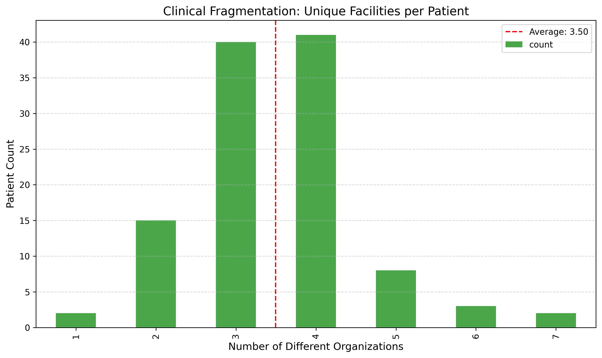
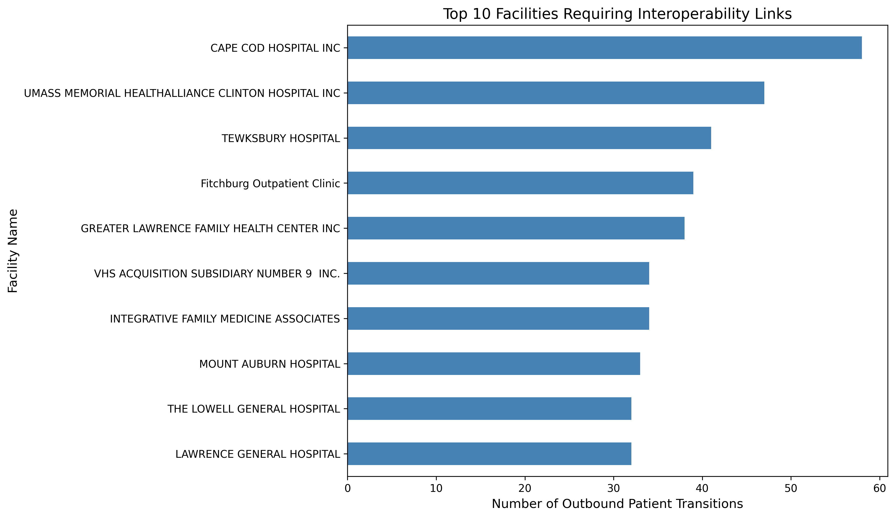

# Medication Duplication Risk Analysis

 

## Overview

Analysis of medication information fragmentation risk when patients receive care across multiple healthcare facilities. Uses synthetic encounter data to identify high-risk care transitions where medication histories are most likely incomplete.

## Motivation

As a hospital pharmacist, I observed how fragmented health information creates preventable safety risks during care transitions. This project quantifies that risk through systematic data analysis.

---

## Key Findings

### Healthcare Fragmentation Patterns

**Summary:**
- **98.2%** of patients (109 of 111) visited multiple healthcare facilities
- Average facilities per patient: **3.50**
- Most common pattern: **4 facilities** per patient
- **94 patients (84.7%)** visited 3 or more facilities, representing high-risk group for medication duplication
- Only **2 patients** received all care at a single facility

**Interpretation:** The near-universal multi-facility care pattern (98.2%) indicates systematic fragmentation in healthcare delivery. With patients averaging 3.5 facilities each, medication information is highly dispersed across disconnected systems.

---

### Critical Care Transition Points

**Summary:**
- Total care transitions analyzed: **2,207**
- Average transitions per patient: **20.2**
- Top facility for patient handoffs: **CAPE COD HOSPITAL INC** (58 transitions)
- High-volume transition facilities require robust interoperability infrastructure

**Interpretation:** With 2,207 care transitions across 111 patients, the healthcare system shows extensive patient movement. CAPE COD HOSPITAL INC, as the highest-volume transition hub, represents a critical point where medication information exchange failures would impact the most patients. These high-traffic facilities should be prioritized for Health Information Exchange (HIE) implementation and clinical decision support integration.

---

## Methodology

1. **Data Loading:** Synthetic encounter records and facility information
2. **Data Preprocessing:** Temporal sorting and facility matching with pandas
3. **Fragmentation Analysis:** Quantifying unique facilities per patient using pandas groupby
4. **Transition Analysis:** Identifying care handoff patterns with pandas shift operations
5. **Statistical Analysis:** Computing average fragmentation with NumPy
6. **Visualization:** Professional publication-quality graphs with matplotlib

## Technical Stack

- **Python 3.x**
- **pandas** - Data manipulation and analysis
- **NumPy** - Statistical calculations
- **matplotlib** - Data visualization
- **Jupyter Notebook** - Interactive analysis environment

## Repository Structure

medication-duplication-risk/
├── data/

│ └── # Synthetic EHR samples

├── figures/

│ ├── fragmentation_distribution.png

│ └── facility_transitions.png

├── notebooks/

│ └── medication_duplication_analysis.ipynb

├── README.md

├── .gitignore

└── LICENSE

## Analysis Notebook

📊 **[View Complete Analysis](notebooks/medication_duplication_analysis.ipynb)**

The Jupyter notebook contains:
- Complete code with detailed comments
- Step-by-step data preprocessing
- Statistical analysis using NumPy
- Professional visualizations
- Clinical interpretation of findings
- Comprehensive conclusions

## Clinical Informatics Relevance

This analysis demonstrates core concepts in health informatics:

- **Interoperability Challenges:** Quantified data fragmentation across 3.5 facilities per patient
- **Clinical Workflow Analysis:** Mapped 2,207 care transitions to understand patient movement
- **Patient Safety Informatics:** Identified system-level vulnerabilities requiring infrastructure solutions
- **Evidence-Based Intervention:** Used data to prioritize health information exchange implementation
- **Systems Thinking:** Analyzed structural problems rather than individual clinical errors

## Limitations

- Based on synthetic data; real-world patterns may vary
- Analyzes risk conditions, not actual medication errors
- Simplified representation of complex clinical workflows
- Does not measure patient outcomes
- Temporal patterns between transitions not analyzed

## Future Directions

**Immediate Extensions:**
- Integration with prescription monitoring program data
- Analysis of specific medication classes (controlled substances, anticoagulants)
- Temporal pattern analysis (time between transitions)
- Facility pair analysis (bilateral transition volumes)

**Advanced Applications:**
- Predictive modeling for high-risk patient transitions
- Real-time alert system for multi-facility patients
- Cost-benefit analysis of HIE implementation prioritization
- Machine learning classification of high-risk care patterns

## Author

**Mohammed Al Bahrani**  
PharmD | Pharmacist  

📧 m.abdulmajeed.albahrani@gmail.com  
💼 [LinkedIn](https://linkedin.com/in/mohammedbahrani)  
🐙 [GitHub](https://github.com/mohammedbahrani)

## License

MIT License - See LICENSE file for details

